 

📖 Оглавление

 
- [Этап 1: Введение в Linux](#этап-1-введение-в-linux)
  - [1.1 Общая информация о курсе](#11-общая-информация-о-курсе)
  - [1.2 Как установить Linux](#12-как-установить-linux)
  - [1.3 Осваиваем Linux](#13-осваиваем-linux)
  - [1.4 Terminal: основы](#14-terminal-основы)
  - [1.5 Запуск исполняемых файлов](#15-запуск-исполняемых-файлов)
  - [1.6 Ввод/вывод](#16-вводвывод)
  - [1.7 Скачивание файлов из интернета](#17-скачивание-файлов-из-интернета)
  - [1.8 Работа с архивами](#18-работа-с-архивами)
  - [1.9 Поиск файлов и слов в файлах](#19-поиск-файлов-и-слов-в-файлах)
- [Этап 2: Удалённый сервер, обмен файлами, процессы, tmux](#этап-2-удалённый-сервер-обмен-файлами-процессы-tmux)
  - [2.1 Знакомство с сервером](#21-знакомство-с-сервером)
  - [2.2 Обмен файлами](#22-обмен-файлами)
  - [2.3 Запуск приложений](#23-запуск-приложений)
  - [2.4 Контроль запускаемых программ](#24-контроль-запускаемых-программ)
  - [2.5 Многопоточные приложения](#25-многопоточные-приложения)
  - [2.6 Менеджер терминалов tmux](#26-менеджер-терминалов-tmux)
- [Этап 3: Vim, bash-скрипты, регулярные выражения, grep, sed, gnuplot, права доступа](#этап-3-vim-bash-скрипты-регулярные-выражения-grep-sed-gnuplot-права-доступа)
  - [3.1 Редактор vim](#31-редактор-vim)
  - [3.2 Bash: история команд и скрипты](#32-bash-история-команд-и-скрипты)
  - [3.3 Bash: функции и циклы](#33-bash-функции-и-циклы)
  - [3.4 Bash: find и опции регистра](#34-bash-find-и-опции-регистра)
  - [3.5 Регулярные выражения и grep](#35-регулярные-выражения-и-grep)
  - [3.6 Sed и gnuplot](#36-sed-и-gnuplot)
  - [3.7 Gnuplot](#37-gnuplot)
  - [3.8 Права доступа](#38-права-доступа)
 

 
 
 
## Этап 1: Введение в Linux
 
### 1.1 Общая информация о курсе
 
Правильное название курса — «Введение в Linux», так как все последующие задания посвящены основам работы в этой операционной системе.
 
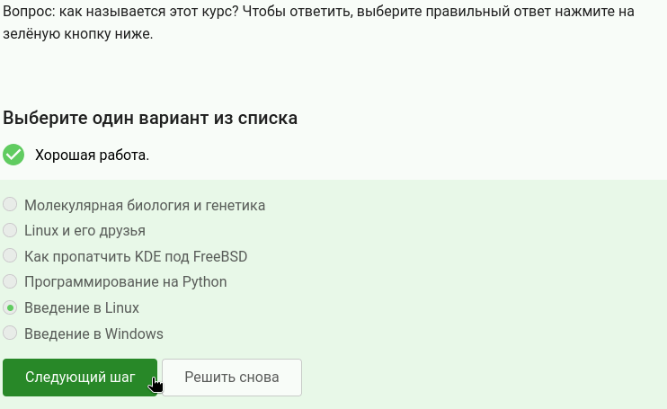
 
Нужно отметить все верные утверждения: дедлайнов нет (курс можно проходить в своём темпе), задачи решаю самостоятельно (чтобы получить максимальную пользу), не выкладываю решения (чтобы другим было интересно).
 
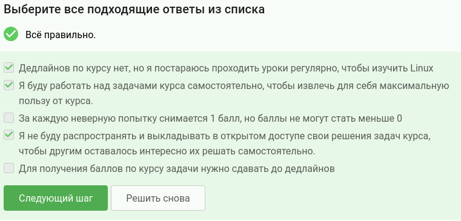
 
### 1.2 Как установить Linux
 
Любой вариант ответа верный — вопрос собирает статистику об используемых операционных системах.
 
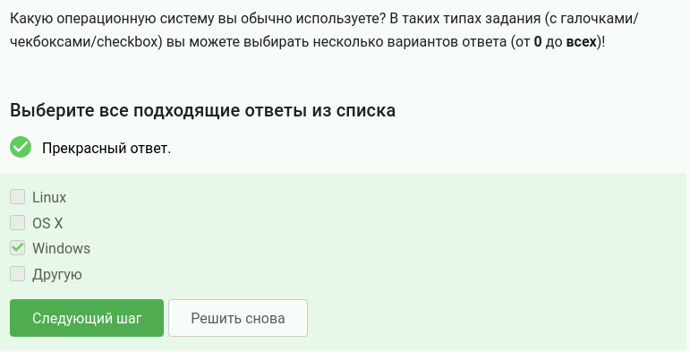
 
Любой вариант ответа верный — вопрос собирает статистику о предпочтениях браузеров.
 
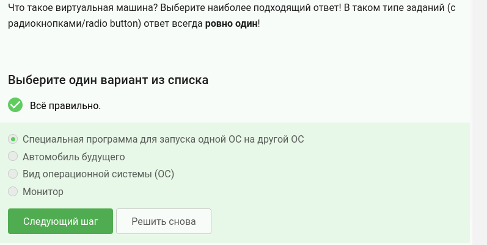
 
Любой вариант ответа верный — вопрос собирает статистику о времени, которое слушатели готовы уделять курсу.
 
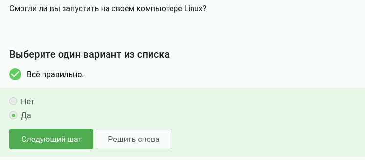
 
### 1.3 Осваиваем Linux
 
Нужно создать документ в LibreOffice Writer с текстом «Hello, Linux!», сохранить в формате XML (Microsoft Word 2003 XML) или FODT и загрузить.
 

 
Сообщение подтверждает успешную загрузку файла — задание выполнено корректно.
 
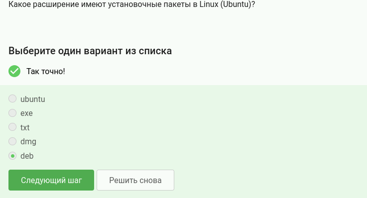
 
Команда `cal` выводит календарь. Год виден в верхней строке.
 
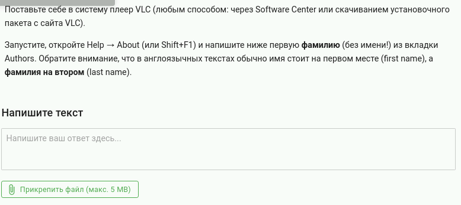
 
При вводе `cal` отображается календарь с текущим годом (например, 2026).
 
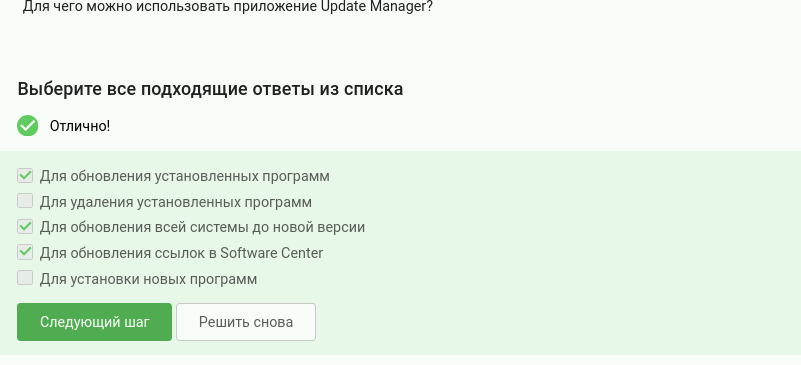
 
### 1.4 Terminal: основы
 
«Терминал», «консоль» и «tty» — синонимы командной строки в Linux.
 
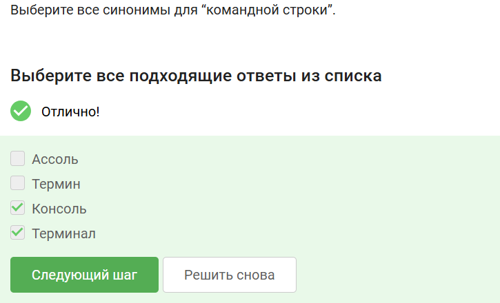
 
`pwd` (print working directory) показывает полный путь к текущей папке.
 
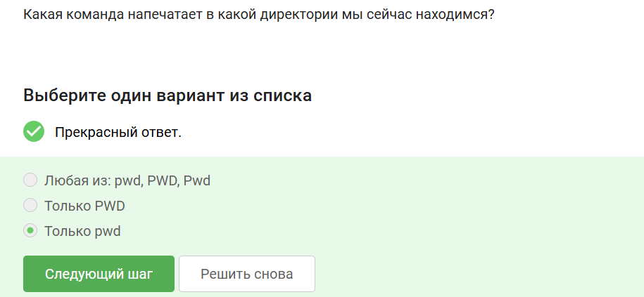
 
Эквивалентные команды: `ls -lAh /some/directory` (те же опции: -A, -l, -h).
 
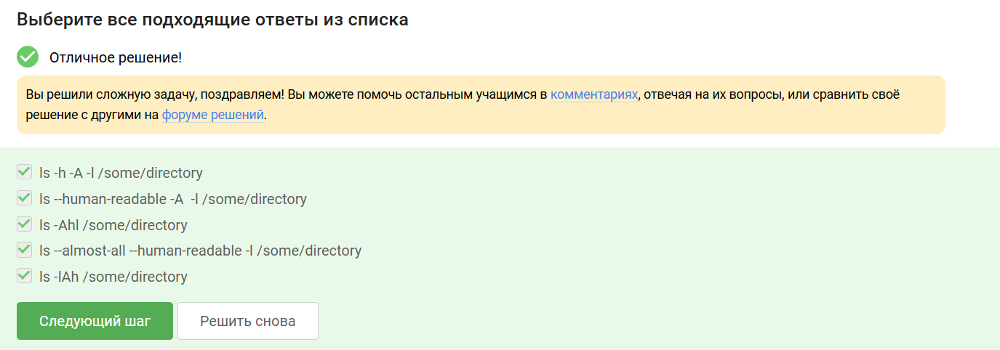
 
Символ `~` означает домашнюю директорию. `ls ~/Downloads` выведет содержимое `/home/bi/Downloads`.
 
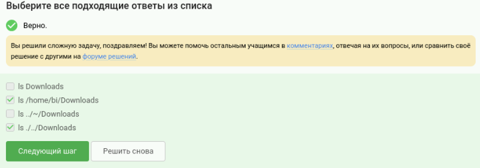
 
`ps` показывает процессы текущего пользователя, `ps aux` — все процессы в системе.
 
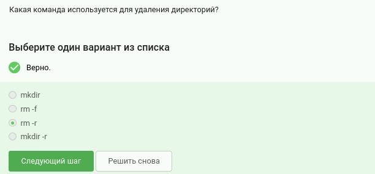
 
### 1.5 Запуск исполняемых файлов
 
Firefox запускается в фоне, поэтому после `exit` терминал закрывается, а браузер продолжает работу.
 
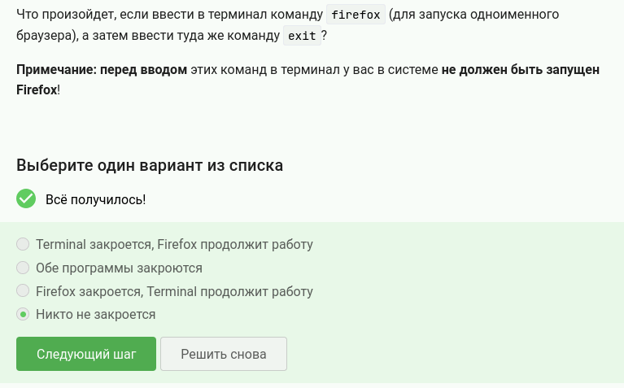
 
`cat` без аргументов ждёт ввод с клавиатуры. Ctrl+C (SIGINT) прерывает выполнение.
 
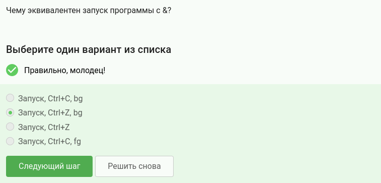
 
Нужно сделать файл исполняемым (`chmod +x`) и запустить его.
 
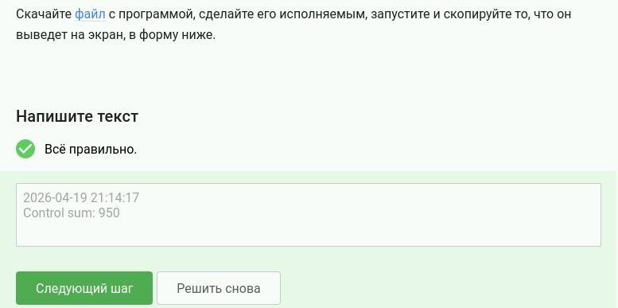
 
Программа выводит текущую дату, время и контрольную сумму.
 
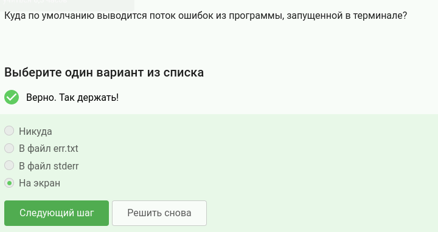
 
### 1.6 Ввод/вывод
 
`2>` перенаправляет stderr в файл с перезаписью, `2>>` — с дозаписью.
 
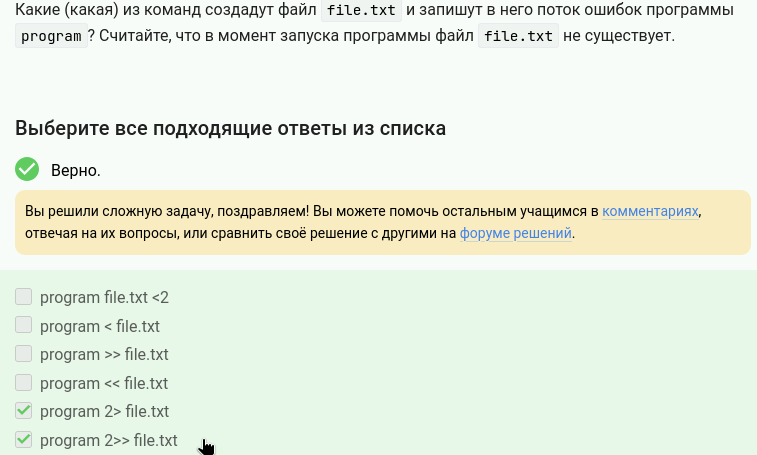
 
Pipe (`|`) перенаправляет только stdout, stderr выводится на экран.
 
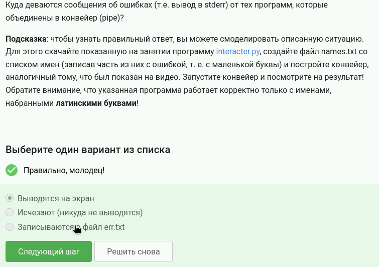
 
### 1.7 Скачивание файлов из интернета
 
`fg` (foreground) возвращает приостановленный процесс на передний план.
 
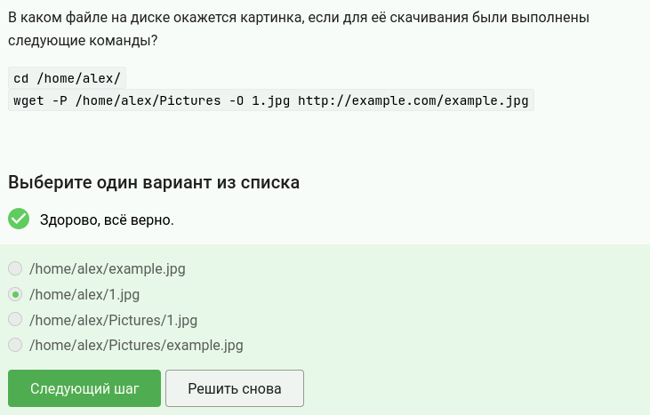
 
Опция `-P` задаёт директорию для сохранения, `-O` — имя файла. `-q` (quiet) подавляет вывод сообщений wget.
 
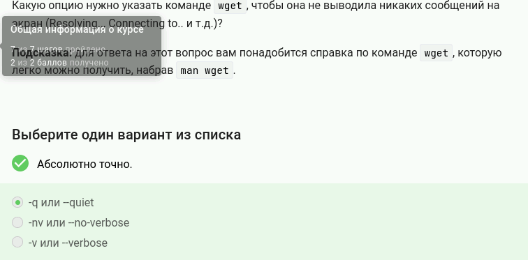
 
`wget -r -l 1 -A jpg` скачивает только JPG с глубиной перехода 1 уровень.
 
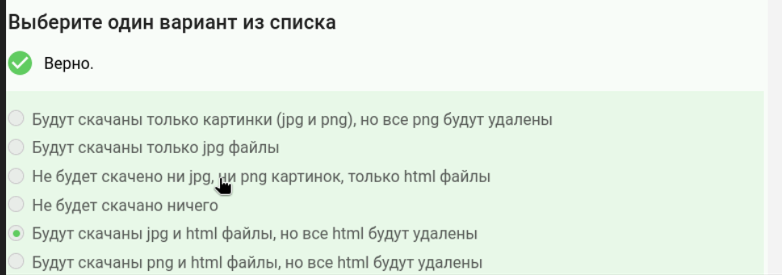
 
### 1.8 Работа с архивами
 
Gzip удаляет архив после распаковки, Zip — сохраняет.
 
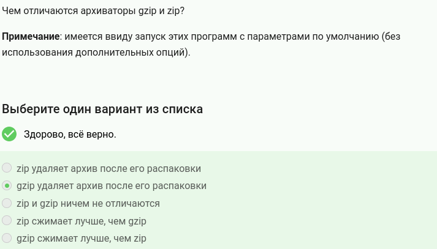
 
Tar и zip работают с директориями, gzip — только с одним файлом.
 
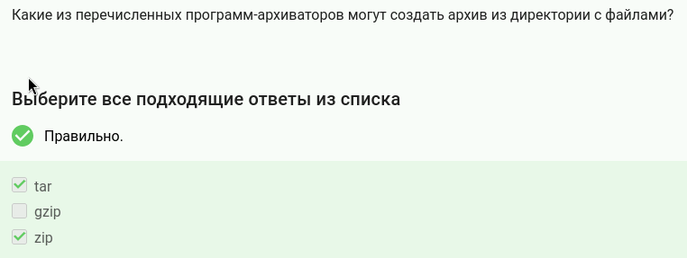
 
`tar -czf` создаёт архив, `tar -xzf` распаковывает.
 
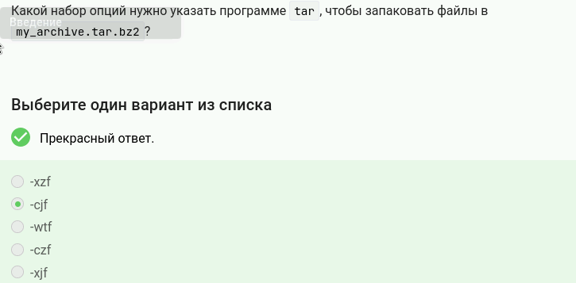
 
### 1.9 Поиск файлов и слов в файлах
 
Маска `*.jpg` не найдёт `Alexey.jpeg`, так как расширение разное.
 
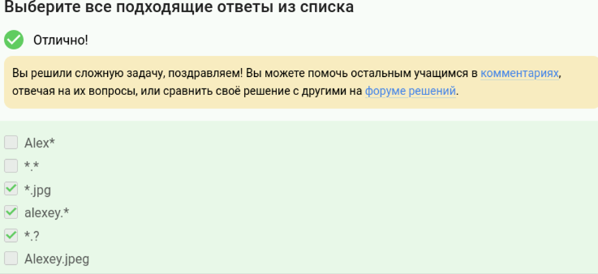
 
`grep "world"` ищет точное вхождение с учётом регистра.
 
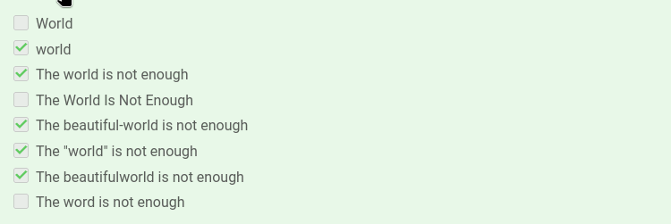
 
`grep "love" shakespeare.txt > love_lines.txt` сохраняет строки с "love" в файл.
 
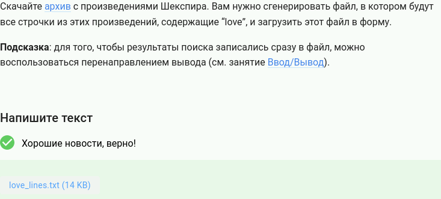
 
---
 
## Этап 2: Удалённый сервер, обмен файлами, процессы, tmux
 
### 2.1 Знакомство с сервером
 
Удалённый сервер можно использовать для выполнения сложных вычислений, хранения больших объёмов данных, хранения общедоступных и конфиденциальных данных.
 
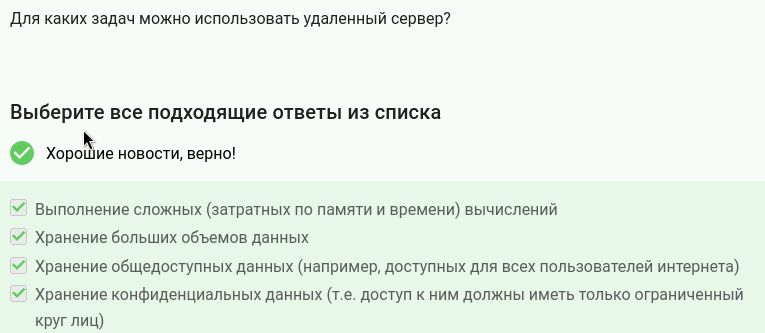
 
Публичный ключ id_rsa.pub можно без опаски пересылать по интернету, приватный ключ id_rsa необходимо хранить в секрете.
 
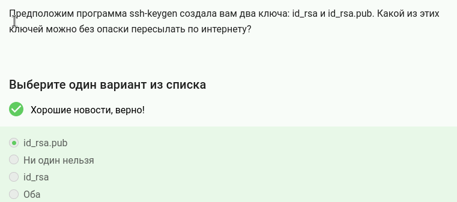
 
### 2.2 Обмен файлами
 
Папку stepic вместе с содержимым на сервер копирует команда `scp -r`, так как scp копирует по SSH, а флаг `-r` нужен для рекурсивного копирования папок.
 
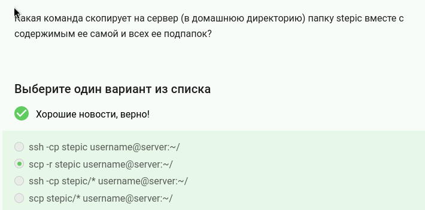
 
Если `sudo apt-get install` не может найти пакет, нужно проверить интернет-соединение — чаще всего проблема именно в отсутствии соединения с репозиторием.
 
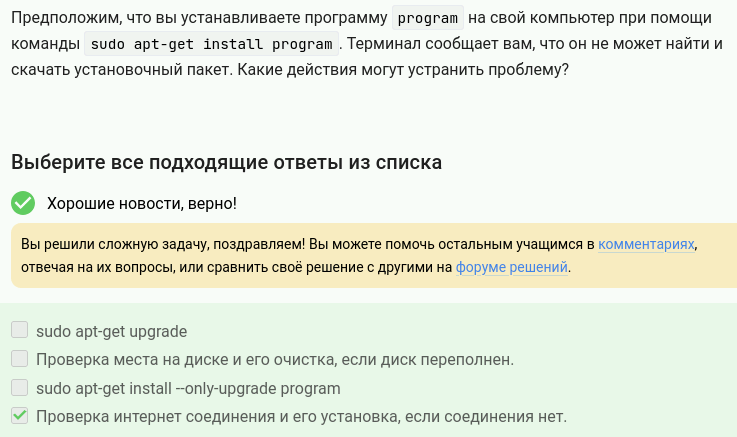
 
Filezilla используется для просмотра содержимого локальных и удалённых директорий, а также для копирования файлов между компьютерами.
 
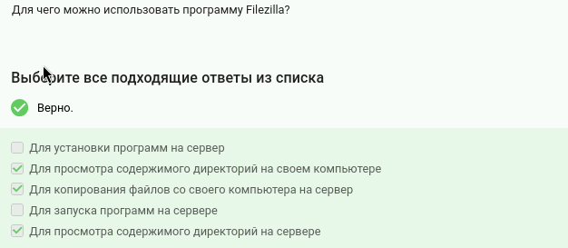
 
### 2.3 Запуск приложений
 
Если программе нужен графический интерфейс, можно настроить сервер для вывода информации на экран или запустить программу на своём компьютере.
 
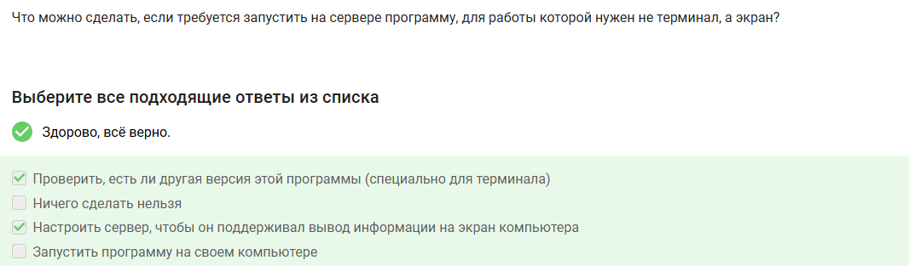
 
Справочную информацию о программе можно вызвать командами `help`, `--help` или `man` — это стандартные способы получения справки в Linux.
 
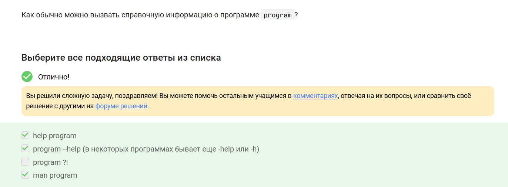
 
FastQC на вход принимает форматы bam, sam, fastq — это основные форматы для данных секвенирования.
 
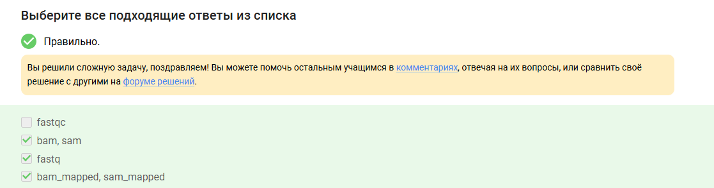
 
ClustalW с множественным выравниванием запускается командой с опцией `-align`, которая явно указывает выполнить множественное выравнивание.
 
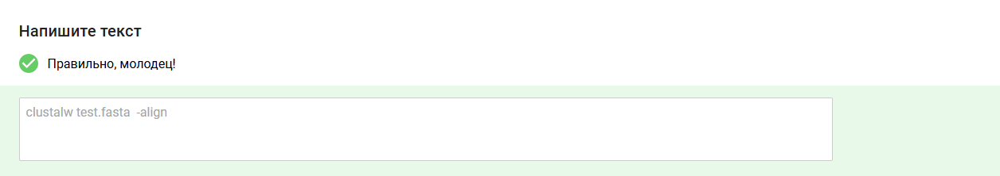
 
### 2.4 Контроль запускаемых программ
 
После `fg`, `Ctrl+C`, `fg`, `Ctrl+Z` команда `jobs` покажет только program2 и program3, так как program1 была завершена.
 
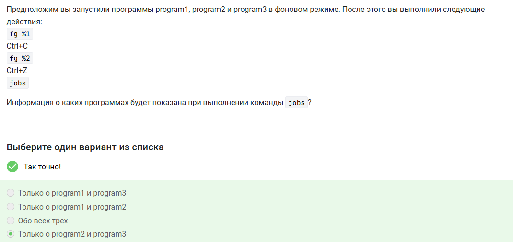
 
Одинаковые идентификаторы только у `ps` и `top`, потому что `jobs` показывает внутренние ID оболочки, а `ps` и `top` — системные PID.
 
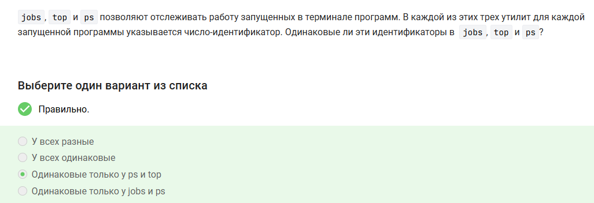
 
Остановленный процесс можно мгновенно завершить командой `kill -9`, так как сигнал SIGKILL завершает процесс немедленно.
 
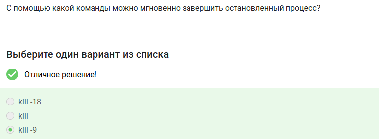
 
Если использовать `kill` без опций к приостановленному процессу, процесс будет завершён, так как `kill` по умолчанию отправляет SIGTERM.
 
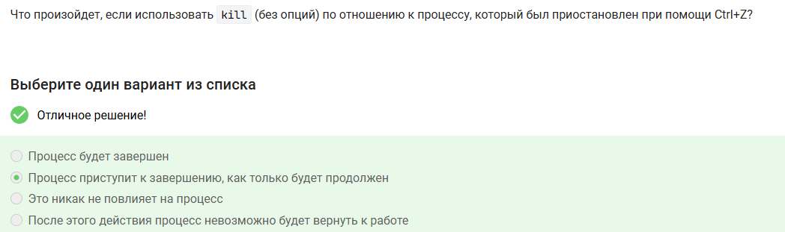
 
### 2.5 Многопоточные приложения
 
Остановленное многопоточное приложение использует 0% CPU, так как остановленный процесс не выполняется и не потребляет процессорное время.
 
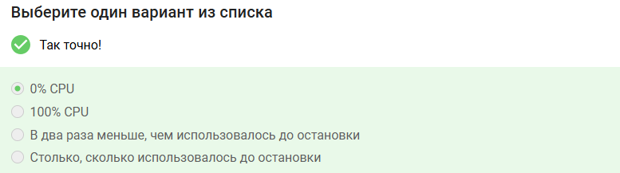
 
Остановленное приложение занимает столько же памяти, сколько потребляло в момент остановки, потому что память остаётся зарезервированной для возобновления работы.
 
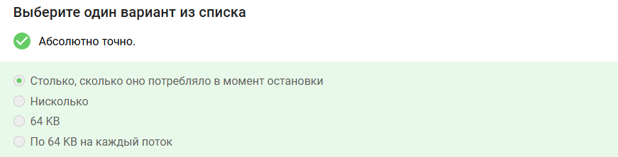
 
Принудительно завершить один из потоков запущенного многопоточного приложения нельзя.
 
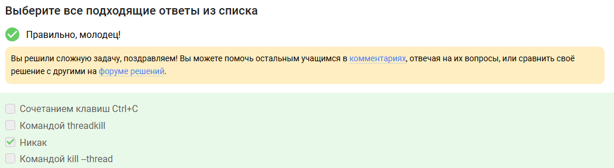
 
Перед запуском bowtie2 необходимо установить программу через `dnf`.
 
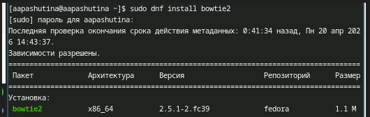
 
Из шагов bowtie2 в несколько потоков можно выполнить только bowtie2, так как индексация однопоточная, а выравнивание поддерживает многопоточность.
 
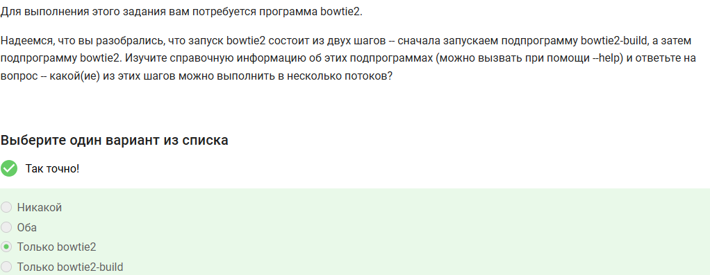
 
### 2.6 Менеджер терминалов tmux
 
При вводе `fg` в другой вкладке терминал сообщит, что нет процесса для `fg`, потому что приостановленный процесс существует только в своей вкладке.
 
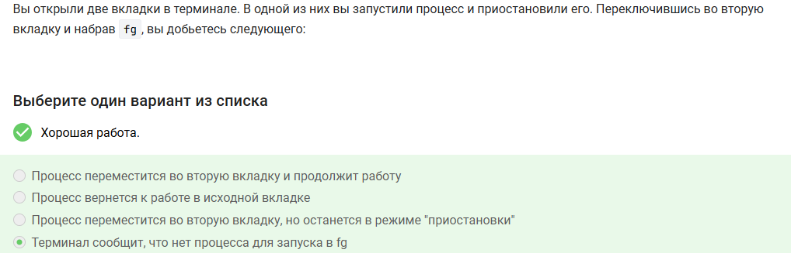
 
При вводе `exit` в последней вкладке tmux завершит работу, так как закрытие последней вкладки завершает сессию.
 
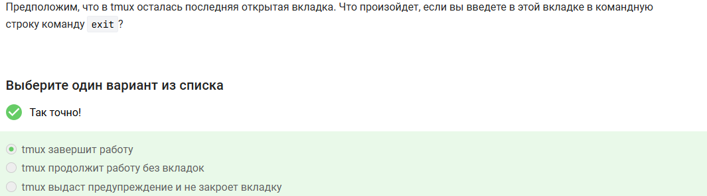
 
Если закрыть терминал с запущенным на сервере tmux, соединение прервётся, но tmux продолжит работу — он сохраняет сессию на сервере.
 
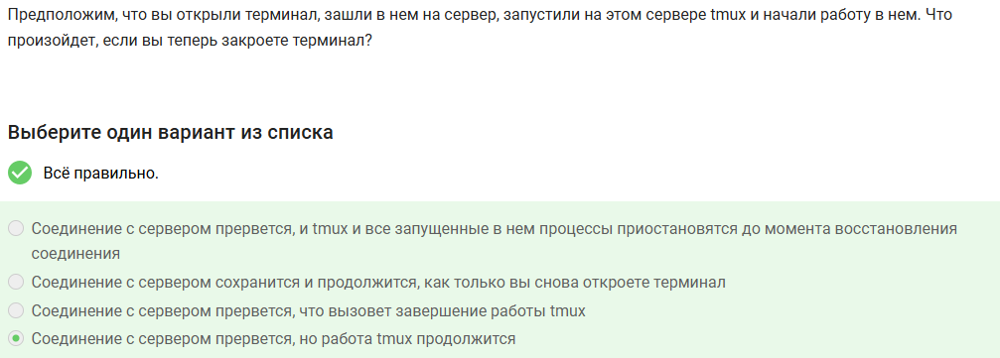
 
При закрытии вкладки с фоновым процессом вкладка закроется и процесс пропадёт, так как процессы внутри закрываемой вкладки завершаются.
 
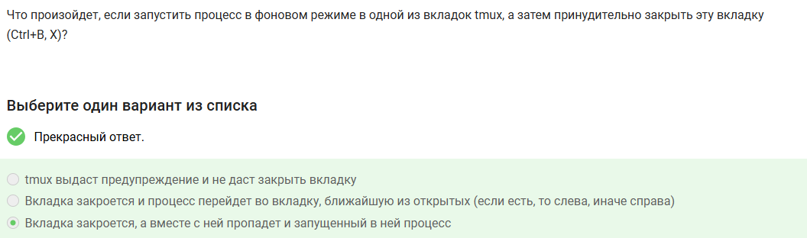
 
Текущую вкладку tmux переименовывает команда `Ctrl+B` и `,` (запятая) — это стандартное сочетание для переименования окна.
 

 
Команды разделения действуют только в текущей вкладке. При горизонтальном и последующем вертикальном разделении получается 3 части: одна большая и две маленькие.
 

 
---
 
## Этап 3: Vim, bash-скрипты, регулярные выражения, grep, sed, gnuplot, права доступа
 
### 3.1 Редактор vim
 
Выйти из редактора vim сразу после открытия файла можно командой `:q`. Команда `:q` означает quit (выход). Если файл был изменён, потребуется `:q!` для принудительного выхода без сохранения.
 

 
Разница между `w` (word) и `W` (WORD): `w` перемещается по словам, разделённым пробелами и пунктуацией, а `W` — только по пробелам.
 

 
Преобразование строки `one two three four five` в `three four four four five` можно выполнить комбинациями `d2w$bifour <Esc>` или `d2dwyyWp`.
 

 
Команда для замены первого вхождения `Windows` на `Linux` в каждой строке: `:%s/Windows/Linux/`.
 

 
Режим выделения (Visual) открывается клавишей `V`. В нём доступны команды перемещения, удаления (`d`), копирования (`y`). Выход из режима — два нажатия `Esc`.
 

 
### 3.2 Bash: история команд и скрипты
 
Каждая запущенная оболочка (bash, sh) имеет свою собственную историю команд. При выходе из дочерней оболочки её история не передаётся родительской.
 

 
Команда `cd` внутри скрипта меняет текущую директорию только для самого скрипта. Файл `file1.txt` создаётся в `/home/bi/`.
 

 
Имена переменных в bash могут состоять из букв, цифр и символа подчёркивания, но не могут начинаться с цифры.
 

 
Скрипт принимает два аргумента и выводит их в формате `Arguments are: $1=первый $2=второй`.
 

 
Условия, которые всегда истинны: `$# -ge 0`, `! (4 -le 3)`, `-z ""`, `$var1 == $var2 || $var1 != $var2`.
 

 
Скрипт выводит `two` при `var=3` и `four` при `var=5`.
 

 
Скрипт определяет количество студентов: `0 → No students`, `1 → 1 student`, `2–4 → N students`, `≥5 → A lot of students`.
 

 
Цикл `for str in a, b, c_d` перебирает 5 элементов. Слово `start` выводится 5 раз, `finish` — 4 раза.
 

 
Скрипт определяет возрастную группу: `child` ≤16, `youth` 17–25, `adult` >25. При пустом имени или возрасте 0 выводит `bye`.
 

 
Для увеличения `a` на значение `b` подходят: `let "a+=b"`, `let a=a+b`, `let "a=$a+$b"`.
 

 
Обратные кавычки `` `pwd` `` выполняют команду `pwd`. Команда `echo "\`pwd\`"` выводит путь к текущей директории.
 

 
Код возврата программы хранится в переменной `$?`. Проверка: `if [[ $? -eq 0 ]]`.
 

 
### 3.3 Bash: функции и циклы
 
В функции `counter` переменная `c1` — локальная, `c2` — глобальная. После десяти вызовов: `c2 = 110`, `c1` пустая. Результат: `counters are and 110`.
 

 
Скрипт находит НОД двух чисел алгоритмом Евклида. При пустом вводе выводит `bye`.
 

 
Калькулятор поддерживает операции `+`, `-`, `*`, `/`, `%`, `**`. `exit` → `bye`, неверная команда → `error`.
 

 
### 3.4 Bash: find и опции регистра
 
`-iname` ищет без учёта регистра, `-name` — с учётом.
 

 
`-path` ищет по полному пути, `-name` — только по имени файла.
 

 
`find /home/bi -mindepth 2 -maxdepth 3 -name "file*"` ищет на глубине 2–3 уровня.
 

 
### 3.5 Регулярные выражения и grep
 
Опции `-A 1`, `-B 1`, `-C 1` добавляют контекстные строки. Размер `results.txt` примерно одинаковый.
 

 
Регулярное выражение `[xkXKL]?[uU]buntu$` ищет `Ubuntu` с возможным префиксом.
 

 
`grep -E "[xkXKL]?[uU]buntu$" text.txt` находит соответствующие строки.
 

 
### 3.6 Sed и gnuplot
 
Без `-n` sed выводит каждую строку дважды.
 

 
`sed "/[a-z]*/p"` выводит каждую строку дважды.
 

 
`sed 's/[A-Z]\{2,\}/abbreviation/g' input.txt > edited.txt` заменяет аббревиатуры.
 

 
### 3.7 Gnuplot
 
`-p` или `--persist` оставляет графики открытыми после закрытия gnuplot.
 

 
`set key autotitle columnhead` берёт название из первой строки первого столбца. Точек — 10.
 

 
`set xtics ("point 1, value ".x1, "point 2, value ".x2, "point 3, value ".x3)`
 

 
Ошибка `invalid expression` — неправильная конкатенация строк (пропущена точка `.`).
 

 
Для зеркального отражения и ускорения вращения нужно изменить знак Z и увеличить шаг в `move.rot`.
 

 
### 3.8 Права доступа
 
Права `rwxr-xr--` (754): владелец — `rwx`, группа — `r-x`, остальные — `r--`.
 

 
Чтобы пользователь из группы мог создавать файлы: `chown user:group dir` или `chmod g+w dir`.
 

 
`wc -l` (строки), `-w` (слова), `-m` (символы), `-c` (байты). Длину строки `wc` не показывает.
 

 
`du -sh` — размер текущей директории в человеко-читаемом формате.
 

 
`mkdir dir{1..3}` — три поддиректории за одну команду.
 

 
Курс «Введение в Linux» завершён. Сертификат с отличием (125 баллов из 125).
 

 
---
 
## Итоги
 
В ходе прохождения курса «Введение в Linux» были освоены следующие навыки:
 
- **Основы Linux:** навигация по файловой системе, управление процессами, перенаправление ввода-вывода
- **Удалённая работа:** подключение к серверу по SSH, копирование файлов (scp), работа с FTP-клиентом Filezilla
- **Управление процессами:** фоновый и передний план, сигналы (kill, kill -9), мониторинг (jobs, ps, top)
- **Многопоточные приложения:** особенности работы bowtie2
- **Менеджер терминалов tmux:** сессии, окна, панели, работа с фоновыми процессами
- **Редактор vim:** режимы, навигация, замена текста, визуальный режим
- **Bash-скрипты:** переменные, условия, циклы, функции, чтение ввода, калькулятор, НОД
- **Регулярные выражения и grep:** поиск по шаблонам, опции -A/-B/-C
- **Sed:** замена текста по шаблону
- **Gnuplot:** построение графиков, настройка осей, анимация
- **Права доступа:** chmod, chown
 
Курс завершён с максимальным результатом — 125 баллов из 125, получен сертификат с отличием.
